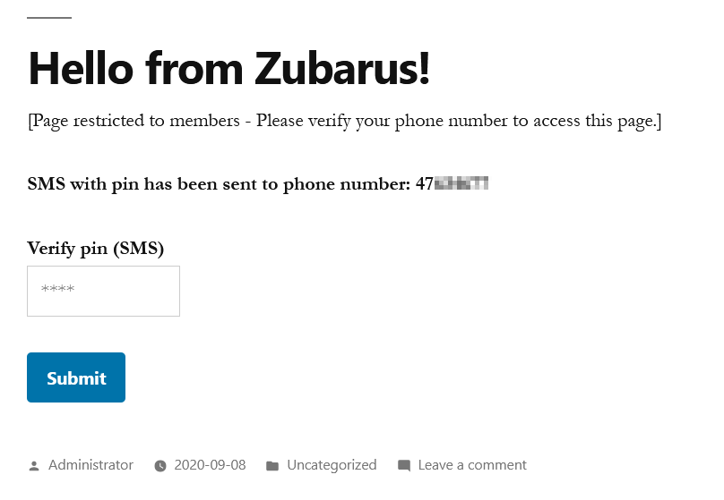

# Zubarus - Members Only

The Zubarus - Members Only plugin for Wordpress allows you to restrict pages/posts to members that have verified their membership via the Zubarus API.

Guests that have not verified their membership will only see a placeholder text, which can be edited via the Wordpress dashboard.

**Important note**: Currently only the _content_ of the page is replaced with the placeholder text. The **title of the page** and the **header image** are left as-is and will be displayed as normal to anyone (including guests).  
Restricted pages are also shown as normal to users that are logged into Wordpress normally and have the permissions to edit any posts or pages (editors, administrators etc.).

## Installation

Download the ZIP file from the [latest release](https://github.com/Zubarus/Zubarus-WordPress-Members-Only/releases/latest) and install it via your WordPress dashboard (see [Manual upload via WordPress dashboard](https://wordpress.org/support/article/managing-plugins/#manual-upload-via-wordpress-admin)).

## Requirements

- A Wordpress site
- Zubarus API credentials
    - Send us an email if you don't have API credentials already or if you have any questions: [post@zubarus.com](mailto:post@zubarus.com)

## License

Plugin license: [GNU General Public License - Version 3](./LICENSE)

## Translations

Currently the plugin supports English and Norwegian (bokmål).  
Please note that the translations only affect the Wordpress dashboard / control panel and not the public-facing pages.  
For instance; The "Members Only" placeholder text is the same for all languages, so write somnething that covers the majority of your userbase.

## Placeholder text

The placeholder text allows you to specify what should be displayed to "guests" (non-members) of your Wordpress website.  
By default the following text is specified:

```
[Members Only] You need to verify your membership to access this page.

{verify_phone_form}
```

At the bottom there's a `{verify_phone_form}`, which will be replaced with a form for first submitting your phone number (which requests an SMS via the Zubarus API) and second an entry for entering the pin from the SMS.  
See screenshots 1 and 2 for an example of how it would look like in action.

## Screenshots

Note: The phone number/pin code form (`{verify_phone_form}`) has both English and Norwegian translations.  
That also includes the _error messages_ that are part of the form (see screenshot 4 for an example of an error message).

### 1. Verifying phone number

This form is shown to "guests" (users with an expired session or not logged into Wordpress).


### 2. Pin verification

Once a valid phone number is submitted and the Zubarus API says the SMS has been sent, the following page is displayed:



### 3. Member has access to post/page

If the pin verification succeeds, the content of the post/page is shown as normal to the member.


### 4. Error: Could not send SMS

This error message is only displayed if the phone number was invalid, or the Zubarus API reported that a verification SMS could not be sent.


### 5. Plugin options: How to access plugin options via the Wordpress admin dashboard

You can access the plugin options for the "Zubarus - Members Only" plugin via the "Settings" entry on the left sidebar.


### 6. Plugin options: Short description of each option on the page

The options page holds all the relevant options for the plugin.

1. Lists all "public" Wordpress posts/pages that can be restricted.
2. Lists all "private" Wordpress posts/pages that you can unrestrict and make available for guests.
3. Placeholder text for guests.
4. Zubarus API credentials (required for SMS verification).

Points 1 and 2 are described in more detail in [screenshot #7](#7-options-adding-restricted-pages).


### 7. Options: Adding restricted pages

There are currently 4 different post types that are listed under "Add restricted page":
- Scheduled
- Pending Review
- Draft
- Published

The plugin currently does not support any other post types than these four, but it's possible to add more in the future if necessary.

The format of each entry in the dropdown is as follows: `Title [Type/Status]`  
Only posts that are **not already restricted to members-only** are listed in the first dropdown menu.

Posts & pages that are already restricted will be listed in the second dropdown ("Remove restricted page").  
Keep in mind that removing a restricted page only means that it will be available publically (if it's "Published").  
It will **not be deleted** from Wordpress.


